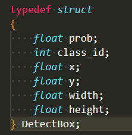
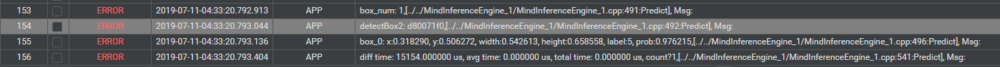
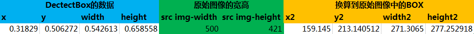
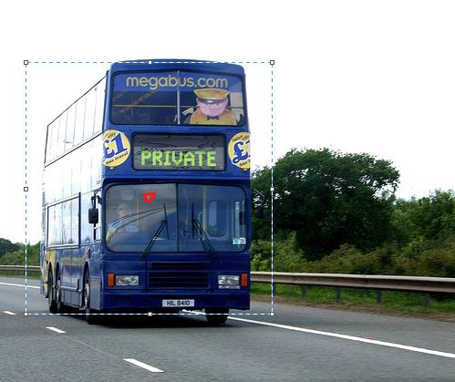

EN|[CN](README.zh.md)

# YOLOv3 D Model DEMO

The demo realizes the inference of YOLOv3 D model. As the last yolo layer is unsupported in D framework, it should be removed when freezing pb model, and be realized in the post process.

### Offline Model Generation

After generating the tensorflow pb model via OMG tool, we get the YOLOv3 D model. And the configs below should be changed as the red boxes show, the Model Image Format should be set as RGB888_U8, the Multiplying Factor should all be set as 0.0039216, and the Mean Less should be set as off.

### Realization of yolo layer

As the last yolo layer is unsupported in D framework, the yolo layer is realized in the post process, the code is in yolo.h in the MindInferenceEngine.

After the inference of YOLOv3 model, we send output data to yolo layer, and output the detectBox data as the result.

The structure of detectBox:

(x,y) is the center coordinate of  boxes, width and height means the width and height of the boxes, prob means the probability of the boxes, the class_id means the id of class.

### Test of D model

The result now shows in the error log, as below:

Line 155 shows that the coordinate of output box is (0.506272, 0.650558), and the prob is 0.976215.

Then we need to transfer the output data to real data, the relationship is shown as follow:

x2=x&times;src_w, y2=y&times;src_h, width2=width&times;src_w, height2=height&times;src_h。 

And the result is like this:

